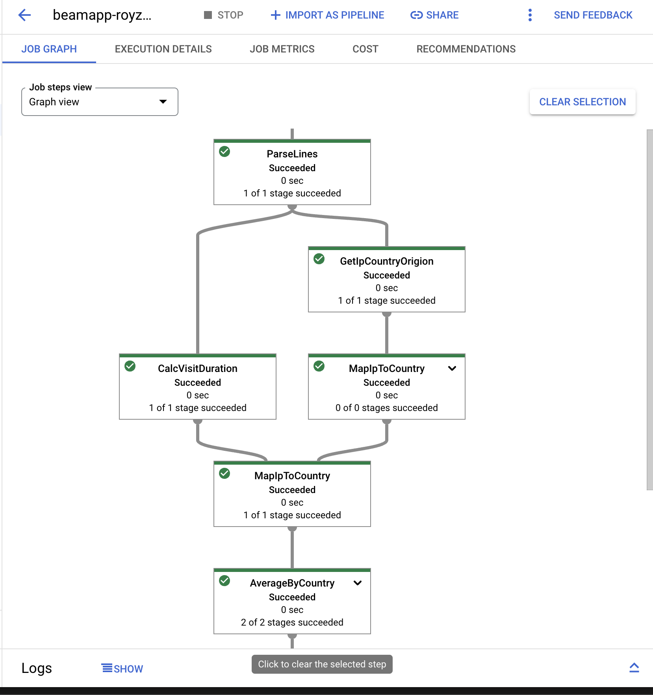

# Apache-Beam Pipeline via Google Cloud Dataflow
This is a simple Apache Beam pipeline that reads a text file from Google Cloud Storage, counts the number of words in the file, and writes the output to a text file in Google Cloud Storage.

## How to run the pipeline
1. Create a new Google Cloud project.
2. Enable the Google Cloud Dataflow API.
3. Create a Google Cloud Storage bucket.
4. Upload the input csv file to the bucket.
5. Create a new service account and download the JSON key file.
6. Set the GOOGLE_APPLICATION_CREDENTIALS environment variable to the path of the JSON key file.
7. Install the required Python packages.
8. Run the pipeline:
```bash
python pipeline.py --region YOUR-REGION --input gs://INPUT-FILEBUCKET-PATH --output gs:/OUTPUT-FILE-PATH --runner DataflowRunner --project YOUR-GCLOUD-PROJECT-NAME --staging_location gs://YOUR-BUCKET/staging --temp_location gs://YOUR-BUCKET/temp --save_main_session
```
9. Check the output in the Google Cloud Storage bucket.
if all goes well, you should see the output file in the output bucket.
[](media/screenshot-dataflow.png)

## References
- [Apache Beam Documentation](https://beam.apache.org/documentation/)
- [Google Cloud Dataflow Documentation](https://cloud.google.com/dataflow/docs)
- [Google Cloud Storage Documentation](https://cloud.google.com/storage/docs)
- [Google Cloud SDK Documentation](https://cloud.google.com/sdk/docs)
- 
